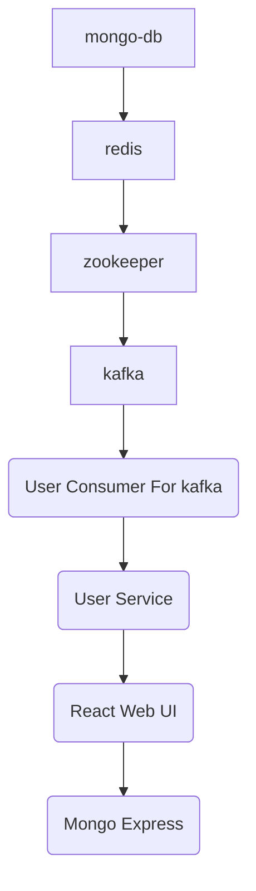

# Project Prerequisite 

* node js
* npm / yarn 
* docker
* docker-compose 
* nx workspace [It will help you to manage project]

# Running flow

```mermaid

graph TD;
    mongo-db--> 
    redis --> 
    zookeeper --> 
    kafka -->
    user-create-consumer(User Consumer For kafka) --> 
    user(User Service) -->
    web-ui(React Web UI) -->
    management-mongo(Mongo Express);
    
```
