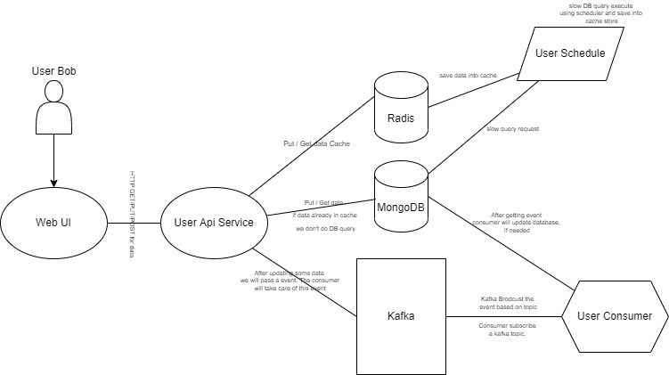
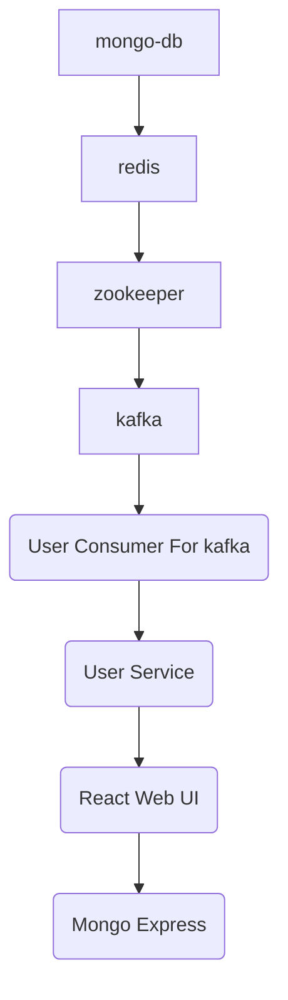
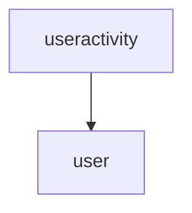
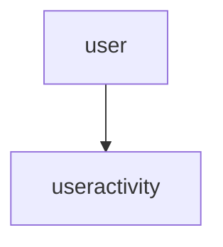
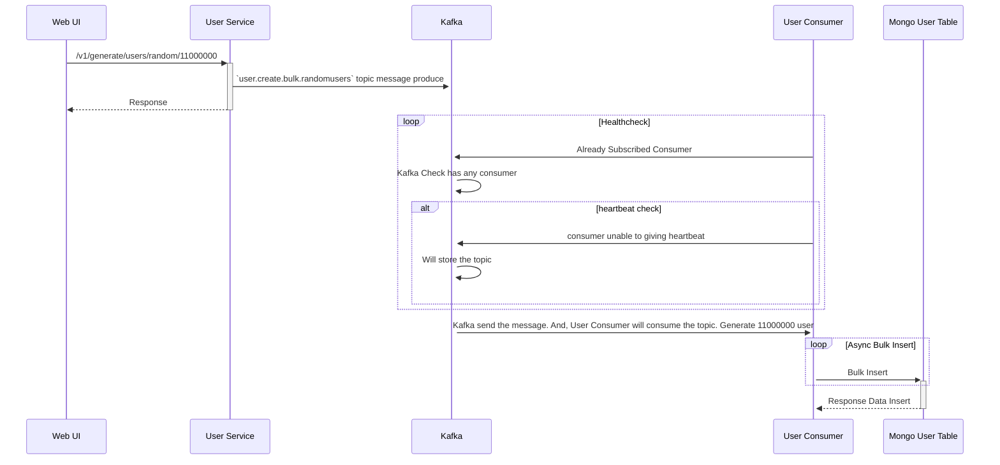
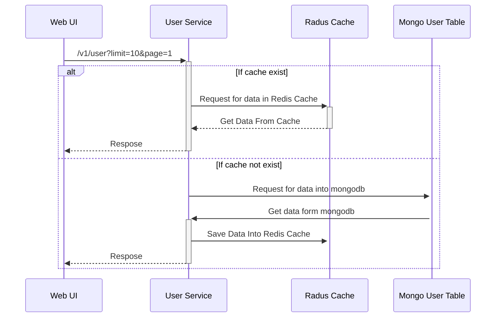

# Introduction 

A system architecture for handling 10M+ user data with a real time dashboard.  

# Project Prerequisite 

* node js
* npm / yarn 
* docker
* docker-compose 
* nx workspace [It will help you to manage project]
* MongoDB
* Kafka
* Radis


# High Level Architecture 




# How to Deploy

## Using docker-compose (Recommended)
```
docker-compose up -d --build
```

## Using Manually 

* First deploy those dependency. Or for all the resources we can run `docker-compose -f docker-compose-resource.yml up -d --build`. 
  * MonngoDB Server. Must Exposed in `27017` Port
  * Redis Server. Must Exposed in`6379` Port. Also, `ALLOW_EMPTY_PASSWORD=yes ,REDIS_DISABLE_COMMANDS=FLUSHDB,FLUSHALL`
  * Zookeeper Server. Must expose in `2181` port
  * Kafka Server, Must expose in `9092` port
* Go to project directory. Run `yarn` . Main reasons is to install the package.
* Run those commend in same order
  * `yarn start user-create-consumer`  
  * `yarn start user` 
  * `yarn start web-ui` 
* web ui will run port `4200`, user service will run port `9000`. user consumer service will consumer kafka user topic.  


# Running/Deployment Flow



# Data/Database Table Deletion Flow



# Data Insertion Flow



# How to Generate Bulk User

## Sequence Diagram



# How to Get Users
## Sequence Diagram



# Video
## Basic Frontend UI

https://user-images.githubusercontent.com/21246862/184919308-1a5e9562-5796-43ae-96bd-4404f5f6dd60.mp4

<!-- ./img-docs/Video/1.basic-ui-when-no-data.mp4  -->

## Real-Time Update With Bulk User Insert


https://user-images.githubusercontent.com/21246862/184919384-10af0e63-1c5c-4d4d-b9ba-2349754d8f29.mp4

<!-- ./img-docs/Video/2-real-time-update.mp4 -->


